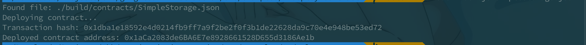

# Nervos赏金

#### Gitcoin: 2) Deploy A Simple Ethereum Smart Contract On Polyjuice

1. A screenshot of the console output immediately after you have successfully deployed a smart contract.

   

2. The transaction hash from the contract deployment (in text format).

   0x1dba1e18592e4d0214fb9ff7a9f2be2f0f3b1de22628da9c70e4e948be53ed72

3. The deployed contract address from the contract deployment (in text format).

   0x1aCa2083de6BA6E7e8928661528D655d3186Ae1b

