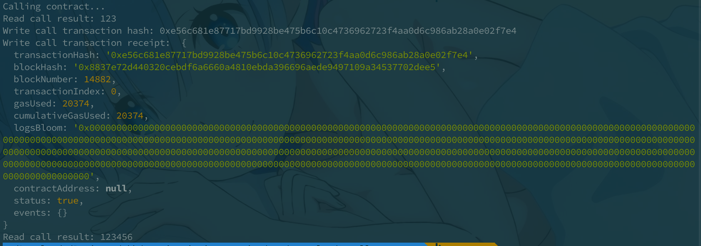

# Nervos赏金

#### Gitcoin: 3) Issue A Smart Contract Call To The Deployed Smart Contract

1. A screenshot of the console output immediately after you have successfully issued a smart contract call.

   

2. The transaction hash from the console output (in text format).

   0xe56c681e87717bd9928be475b6c10c4736962723f4aa0d6c986ab28a0e02f7e4

3. The contract address that you called (in text format).

   0x1aCa2083de6BA6E7e8928661528D655d3186Ae1b

4. The ABI for contract you made a call on (in text format).

   ```js
   [
       {
         "inputs": [],
         "stateMutability": "payable",
         "type": "constructor"
       },
       {
         "inputs": [
           {
             "internalType": "uint256",
             "name": "x",
             "type": "uint256"
           }
         ],
         "name": "set",
         "outputs": [],
         "stateMutability": "payable",
         "type": "function"
       },
       {
         "inputs": [],
         "name": "get",
         "outputs": [
           {
             "internalType": "uint256",
             "name": "",
             "type": "uint256"
           }
         ],
         "stateMutability": "view",
         "type": "function"
       }
   ]
   ```
