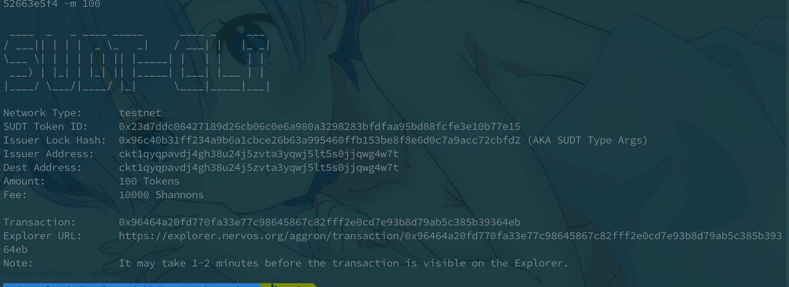
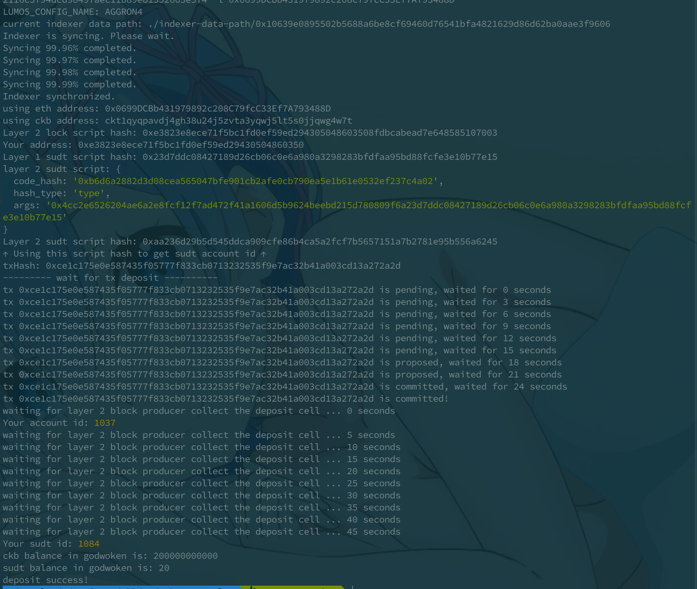

# Nervos赏金

#### Gitcoin: 4) Issue An SUDT Token On Layer 1 And Deposit It To Layer 2

1. A link to the Layer 1 address you funded on the Testnet Explorer.

   ckt1qyqpavdj4gh38u24j5zvta3yqwj5lt5s0jjqwg4w7t

2. A screenshot of the console output immediately after using sudt-cli to create your SUDT tokens on Layer 1.

   

3. A link to the transaction ID created by sudt-cli on the Testnet Explorer.

   [0x96464a20fd770fa33e77c98645867c82fff2e0cd7e93b8d79ab5c385b39364eb](https://explorer.nervos.org/aggron/transaction/0x96464a20fd770fa33e77c98645867c82fff2e0cd7e93b8d79ab5c385b39364eb)

4. A screenshot of the console output immediately after you have successfully submitted a deposit to Layer 2 using the account-cli tool.

   

5. The SUDT ID from the console output after executing the deposit script (in text format).

   1084
