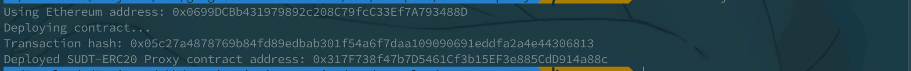
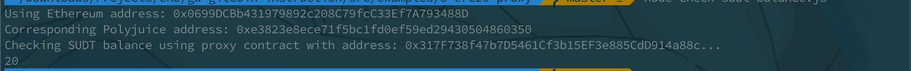

# Nervos赏金

#### Gitcoin: 5) Deploy The ERC20 Proxy Contract For The Deposited SUDT

1. A screenshot of the console output immediately after deploying smart contract.

   

2. The address of the ERC20 Proxy Contract you deployed (in text format).

   0x317F738f47b7D5461Cf3b15EF3e885CdD914a88c

3. A screenshot of the console output immediately after checking your SUDT balance.

   

4. The Ethereum address that was checked (in text format).

   0x0699DCBb431979892c208C79fcC33Ef7A793488D
